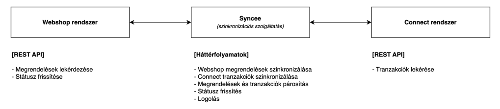
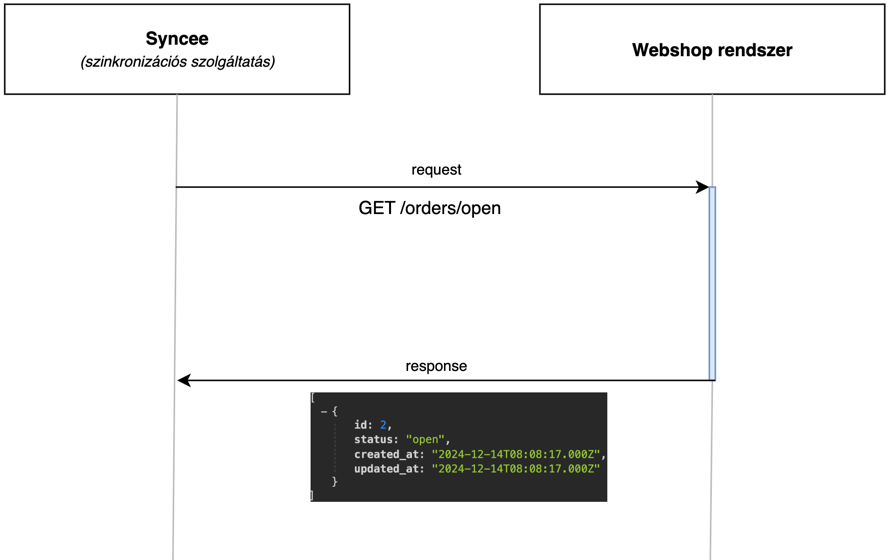
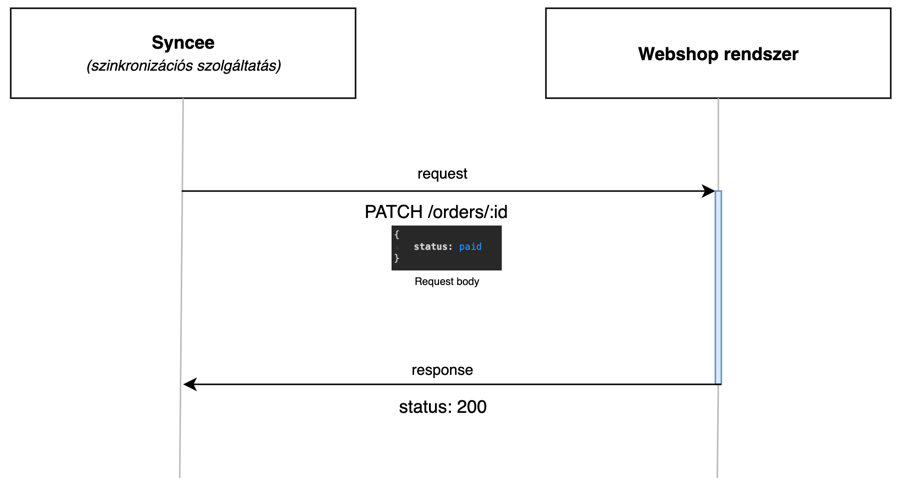
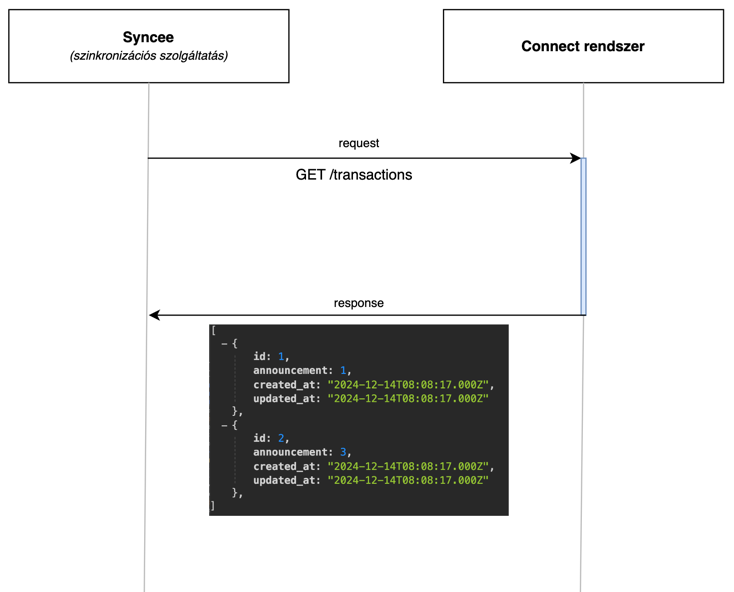
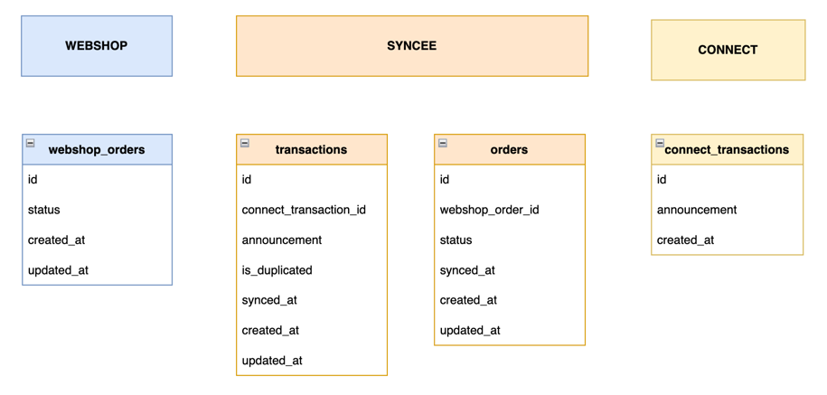
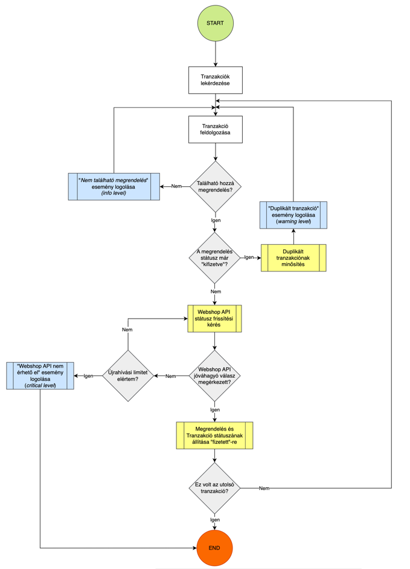

# 2. Vizsgafeladat – Megrendelés állapot szinkronizációs szolgáltatás

---

## 1. Bevezető

Az alábbi dokumentáció tartalmazza a **Syncee** fanzázinevű megrendelés állapot szinkronizációs microservice-t, valamint az ehhez kapcsolódó külső rendszerek - Webshop és Connect - kapcsolatát és működését. 

A leírásban ki fogok térni a rendszer architektúrájára, a rendszerek kapcsolatára, folyamatokra és a konkrét megvalósításokra.  

A rendszer megvalósítása során a vizsgajelleg miatt bizonyos egyszerűsítéseket alkalmaztam, amelyek a valós alkalmazásoknál általában nem így működnek. Az alábbiakban részletezem ezeket:

1. Adatbázis-struktúra egyszerűsítése
: A három komponens (Webshop, Connect, Pairing) mindegyike saját, különálló adatbázist igényelne a valóságban. Az egyszerűség kedvéért itt egy közös adatbázist használok.

2. Connect API végpontjainak egyszerűsített kezelése
: A Connect API paraméterei és filterezési lehetőségei (például tól-ig dátum szerinti lekérdezés) nem ismertek számomra. Ezért a rendszer nem támogat ilyen lehetőségeket, és csak alapvető lekérdezésekkel dolgozik.

3. Társrendszerek és microservice-ek kizárása
: A rendszer tervezése során nem feltételeztem további társrendszerek vagy microservice-ek létezését. Például a logolást a Syncee alkalmazáson belül valósítottam meg, nem külső logkezelő rendszerrel.

4. Kommunikáció formátuma
: Feltételezem, hogy minden rendszerkomponens JSON formátumban kommunikál egymással.

5. Inkrementális azonosítók használata
: Több helyen inkrementális ID-ket alkalmaztam az entitások azonosítására, ami a valós rendszerekben ritkábban használatos, mivel általában UUID-eket vagy más egyedi azonosítókat részesítenek előnyben.

6. Környezetfüggő változók kezelése
: Az .env fájl tartalmát beküldtem a Git repóba, hogy az alkalmazás könnyen működésre bírható legyen. Ez biztonsági szempontból nem ajánlott, és éles rendszereknél nem szokás.

Ezek az egyszerűsítések segítették a rendszer gyorsabb megvalósítását és bemutatását, ugyanakkor a valós alkalmazások esetén ezek helyett a szokásos iparági sztenderdeket és bevált gyakorlatokat kell alkalmazni.

---

## 2. Koncepció

A rendszer két társrendszerrel működik együtt: **Webshop** és **Connect**. Mindkét rendszer API-hívásokon keresztül továbbít adatokat a **Syncee** felé. Mivel ezek aszinkron folyamatok, ezért számos probléma jelentkezhet, mint például hibák, timeout-ok, működési zavarok, adatinkonzisztenciák vagy más problémák. Ezek kezelésére és a folyamatok szétválasztására külön időzített szinkronizációs folyamatot valósítok meg a **Webshop** és a **Connect** rendszerekhez. Az adatok párosítását egy különálló időzített folyamat végzi a Syncee adatbázisában tárolt adatok alapján. 

**Előnyök:**
- Az adatlekérdezési folyamatok és a párosítás különálló, így egymástól függetlenül működhetnek
- Skálázhatóság: Lassú vagy hibás API-válaszok esetén a párosítási logika továbbra is működőképes, mert az adatok már helyben tárolódnak
- A hibakezelés egyszerűbbé válik, mert minden részfolyamat külön kezelhető

**Hátrányok:**
- A megoldás komplexitása növekszik, mert több időzített folyamatot kell karbantartani
- Az adatok átmeneti tárolása növeli az adatbázis-kezelés bonyolultságát

A rendszer kialakítása során a szinkronizációk hibatűrő módon kerülnek implementálásra. Ennek főbb elemei a következők:
- Ha a társrendszerek API végpontjai elérhetetlenek, retry policy-t alkalmazunk
- Hibás adatok esetén a feldolgozás nem áll le; a hibákat logoljuk megfelelő szintű jelöléssel

**A logolás szintjei:**
- critical
: Azon események jelölése, amelyek ellehetetlenítik a szinkronizáció működését. Például, ha a **Webshop** vagy **Connect** végpontjai nem érhetők el.

- error
: Hibák, amelyek a szinkronizáció folytatását nem akadályozzák, de egy adott adatsorhoz kapcsolódnak. Ilyen lehet például, ha egy beérkező adat formátuma nem megfelelő (például `int` helyett `string` érkezik) 

- warning
: Olyan külső rendszerekből érkező problémák jelölése, amelyeket a rendszer saját hatáskörében kezelni tud. Például, ha a **Connect** duplikált adatot küld, ami nem akadályozza a feldolgozást, de rögzíteni kell a rendszerben.  

- info
: Információk rögzítésére szolgál, például annak jelölésére, hogy egy szinkronizációs folyamat elindult.

---

## 3. A rendszer fő komponnsei

Az alábbi ábra prezentálja a rendszer fő komponenseit:

Az egyes komponensek felelősségi körei:

**Webshop rendszer**
- REST API végponton keresztül:
  - Megrendelések lekérdezése
  - Státusz frissítés

**Syncee (szinkronizációs szolgáltatás)**
- Webshop rendszer megrendelések szinkronizálása (időzített)
- Connect rendszer tranzakciók szinkronizálása (időzített)
- Megrendelések és tranzakciók párosítás (időzített)
- Státusz frissítés (esemény vezérelt)
- Logolás

**Connect rendszer:**
- REST API végponton keresztül:
  - Tranzakciók lekérése

---

## 4. Kommunikációs folyamatok az egyes komponensek közt

Az alábbi fejezetben bemutatom az egyes komponensek közti kommunikációt.

### **Syncee** lekéri a **Webshop**-tól a megrendeléseket

### **Syncee** frissíti egy megrendelés státuszát a **Webshop** rendszerben 

### **Syncee** lekéri a banki tranzakciókat a **Connect** rendszerből

---

## 5. Adatbázis terv

Az alábbi ábra szemlélteti az egyes rendszerek adattábláit

---

## 6. Webshop és Connect rendszer implementáció

Mindkét rendszerhez létrehoztam egy-egy NodeJS alapú, egyszerű szolgáltatást. Ezek célja, hogy valós adatbáziskapcsolatot biztosítsanak, valós adatokkal dolgozzanak, valamint lehetőséget nyújtsanak műveletek végrehajtására az adatokon.

A szolgáltatások forrásai a könyvtárstruktúrában a `webshop` és `connect` mappákban találhatók.

---

## 7. Syncee implementáció

A **Syncee** létrehozásához a Symfony-hoz nagyon közel álló Laravel rendszert választottam.

Néhány gondolat ami a review-t segítheti:
- Az implementáció a `syncee` mappában található. 
- A webshop és connect szinkronizáció service-ei az `app\Services\Sync` könyvtárban találhatóak, a párosításhoz a service pedig az `app\Services` mappában, `PairingService.php` néven található. 
- Az időzített futtatást `cron` végzi a Laravel Scheduler-en keresztül, melynek a bekötése itt található: `app\Providers\ScheduleServiceProvider.php`.
- Az alapvetú migrációk a `database/migrations` mappában találhatóak, valamint van egy `seeder` is, ami a szinkronizáláshoz tartozó esetek vizsgálatához nyújt segítséget. 
- Az `app\Http\Controllers\SyncController.php` csak tesztelési időszakban volt használatos.

## 8. Adatpárosítás folyamat

Az alábbi ábra mutatja be az adatpárosítás folyamatát:

**Maga a folyamatleírás:**

- Tranzakciók lekérdezése
- Egy tranzakció feldolgozása
- Tranzakcióhoz tartozó megrendelés található e
  - Ha nem található megrendelés: Logoljuk az eseményt info szinten.
  - Ha igen, megyünk tovább a következő lépésre
- Ellenőrizzük, hogy a megrendelés státusza kifizetett e
  - Ha igen, akkor a tranzakciót duplikációként jelöljük és logoljuk az eseményt warning szinten
  - Ha nem, megyünk tovább a következő lépésre
- Megkísérljük meghívni a Webshop API-t
  - Ha nem sikerül, akkor addig próbáljuk újra, amíg a retry policy engedni. Ha nem sikerül több próbálkozásra sem, akkor logoljuk az eseményt critical szinten és befejeződik a teljes folyamat
  - Ha sikerül megyünk tovább
- Amennyiben pozitív válasz érkezik az állapot frissítésről, a megrendelés és a tranzakció státuszát is synced-re rakjuk
- Ez volt az utolsó tranzakció?
  - Ha nem, akkor visszaugrunk az "egy tranzakció feldolgozása" lépéshez
  - Ha igen, akkor vége a folyamatnak.

## 9. Prezentáció

A prezentáció az alábbi linken érhető el: https://docs.google.com/presentation/d/1y5BXbog101tFWYGWYptPDWP9iu0FSiddo5W1JjIhdFU/edit?usp=sharing
